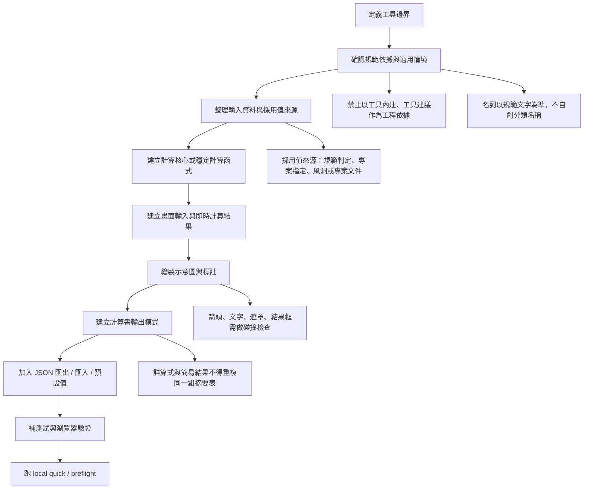
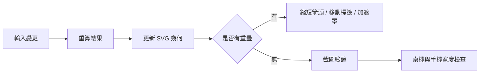
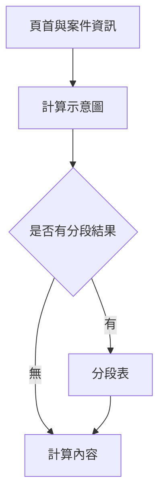
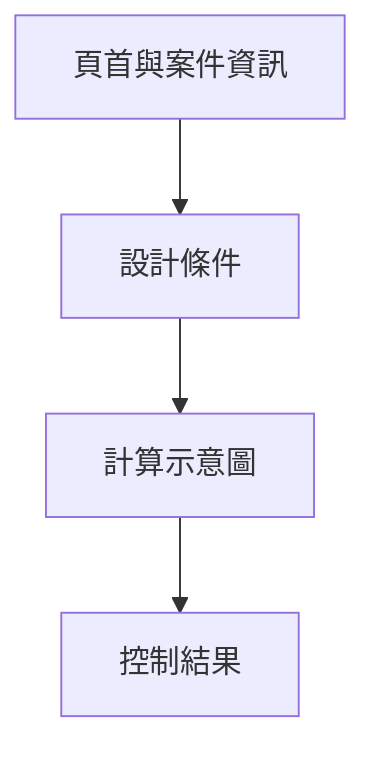

# 工具製作與計算書規範

本檔作為後續製作或重構結構工具前的共用讀本。目標是讓工具畫面、示意圖、列印計算書與驗證流程先有一致基準，避免重複踩到相同問題。

適用範圍：

- `結構工具箱/tools/` 內新增或改版的靜態工程工具。
- 風力、地震力、局部荷重、基礎、土壓、施工臨設等需要輸出計算書的工具。
- 既有工具若新增 JSON 匯入匯出、示意圖、列印報告，也應套用本規範。

## 核心原則

1. 依據主體是規範、專案文件與設計者判定，不是工具本身。
2. 計算路線要能被工程師或技師審閱：輸入、採用值、公式、結果與限制都要可追溯。
3. 規範表格路線應由用途、構造型式、幾何條件與規範適用條件判定；不得讓使用者以自由選擇表格取代規範判定。
4. 專案指定值、風洞試驗值或專案文件值是另一條採用來源，應與規範判定值分開呈現並保留依據。
5. 詳算式與簡易結果是兩種輸出模式，不是同一內容重複貼兩次。
6. 示意圖是計算條件的視覺摘要，不是裝飾圖；箭頭、標註、結果框不得互相遮蔽。
7. 報告內容要避免重複欄位，尤其是計畫名稱、編號、設計人員、版本、設計條件與採用表。
8. 畫面上的適用性檢核、限制提醒、操作防呆屬於輸入輔助，預設不列入送審或簽認用計算書。
9. 每次新增報告格式或輸出流程，都要補回歸測試或瀏覽器 smoke，避免日後退回舊問題。
10. 名詞、表號、構造名稱應以規範文字為準；不得為了 UI 分類、卡片標題或內部口語自行創造替代名稱。

## 工具製作流程



### 工具邊界拆分

若兩種構造型式使用不同規範表格、不同輸入資料模型、不同計算結果表或不同計算書責任，應拆成不同工具頁。首頁可以把相近工具放在同一分類或相鄰卡片，但正式計算頁不得把不同表格路線包成同一個「計算類型」下拉選項。

拆分判斷原則：

- 規範表號不同，且查表條件不同。
- 一種工具需要分段結果表，另一種不需要。
- JSON schema、列印計算書標題、設計條件欄位或控制結果欄位會因此分歧。
- 使用者看到同一頁時容易誤以為兩種構造可以共用同一組工程判定。

例：表 2.11「中空式標示物 / 格子式構架」與表 2.15「桁架高塔」應拆為不同頁；首頁可保持同一風力分類，但頁面、JSON、示意圖與計算書不得混在一起。

## 示意圖說規範

示意圖應在第一眼讓使用者知道目前計算的是什麼、外力作用在哪裡、控制高度或作用位置如何取得。

必要內容：

- 標的物或構件的簡化外形。
- 主要尺寸或高度，例如 `h`、`z`、`z_r`、`H`、`b`、`A`。
- 外力方向箭頭與力值標註，例如 `F`、`Vh`、`Fph`、`ΣF`。
- 結果框可列控制值，但不得遮住外力箭頭或標的物。
- 若有分段計算，圖中可顯示分段線，但不應讓分段線壓過主要尺寸。

圖面規則：

- 箭頭末端應停在結果框或文字框前，不得穿入結果框。
- 箭頭是外力方向符號，不是主視覺；箭身、箭頭、力值標籤不得比標的物更搶眼。
- SVG marker 若會隨 `stroke-width` 放大，應改用固定尺寸，例如 `markerUnits="userSpaceOnUse"`，避免箭頭頭部過大。
- 水平力、垂直力、尺寸箭頭應使用各自的 marker 與線寬，不要共用同一組箭頭樣式。
- 力值標籤字級應小於結果面板主數值；圖面只呈現摘要，完整控制值放在結果面板或計算書表格。
- 文字標註應有局部遮罩，但遮罩不得蓋住構件外框或箭頭頭部。
- 名稱過長時，應換行、截短或移至圖外，不得與結果框重疊。
- 垂直箭頭或低高度標註要做邊界控制，不得跑出 SVG 圖框。
- 文字、箭頭、結果框必須分層並保留安全距離；不得讓箭頭頭部壓到文字、力值標籤或結果框。
- 力值標籤應放在獨立 label 區，箭頭應放在獨立 arrow 區；兩者不得共用同一座標帶。
- 箭頭行進區只放方向符號或短代號（如 `F_p`、`w_s`），完整數值應移至固定的元件摘要框或結果面板，避免數值位數改變時撞到箭頭或構件。
- 高度尺寸標註需保留上下邊界，低高度或近地表情境應縮短箭頭或外移標籤，不得讓箭頭或文字跑出 SVG。
- 重要圖層應加上 `data-diagram-role`，例如 `force-arrow-zone`、`force-label-zone`、`height-arrow-zone`、`force-panel`，方便後續測試與人工檢查。
- 圖面中的建築物、非建築物、設備、牆、塔等，應以具象化但簡潔的線稿呈現。
- 不使用純裝飾圖片；示意圖必須和計算輸入、輸出同步。

建議檢查：



## 計算書版面模式

計算書固定分成「詳算式」與「簡易結果」。兩者目的不同，不能互相重複。

### 共用頁首

共用頁首只出現一次：

- 計算書標題。
- 工具或頁面版本。
- 輸出模式：詳算式或簡易結果。
- 計畫名稱。
- 計畫編號。
- 設計人員。
- 製表日期。

注意：上述案件資訊不得再次放入「設計條件」或「計算內容」表格。

### 詳算式

詳算式是給審閱計算邏輯用，應以計算規則與公式過程為主。

應包含：

- 計算示意圖。
- 分段剪力表或分段結果表，僅在該工具有分段模式時出現。
- 計算內容：逐步列出參數、公式、採用值、代入與結果。

不應包含：

- 設計條件摘要表。
- 設計採用表。
- 控制結果摘要表。
- 與計算內容重複的條件摘要。
- 畫面操作用的適用性檢核、限制提醒、警告或防呆說明。

詳算式版面流程：



### 簡易結果

簡易結果是給快速整理與內部溝通用，應以摘要為主。

應包含：

- 設計條件摘要表。
- 計算示意圖。
- 控制結果摘要表。

不應包含：

- 詳細公式代入過程。
- 分段長表，除非工具使用者明確需要簡表。
- 與控制結果重複的詳細採用表。
- 畫面操作用的適用性檢核、限制提醒、警告或防呆說明。

簡易結果版面流程：



## 計算書內容規範

### 規範名詞

工具名稱、卡片標題、計算書標題、計算步驟與 JSON 中的工具名稱，都應採用規範用語或專案正式用語。例如規範稱「中空式標示物」時，頁面不得改寫為「透空式」或其他口語分類。若工程上需要補充別名，應放在說明文字中，且不得取代規範名詞。

每次新增或重構工具時，至少檢查：

- 標題、首頁卡片、按鈕、計算書標題是否使用同一套規範名詞。
- 規範表號與構造名稱是否一致，例如表 2.11 對應中空式標示物 / 格子式構架，表 2.15 對應桁架高塔。
- JSON 匯出名稱、案件狀態訊息與列印報告是否沒有殘留舊稱或內部口語。

### 規範版本揭露

正式工具的畫面與列印計算書都要明確揭露採用規範全名與年版。風力工具目前以「建築物耐風設計規範及解說」與「107 年版」為必要字串；地震工具以「建築物耐震設計規範及解說」與「113 年版」為必要字串。

這些字串集中登記於 `formal-tools.manifest.json` 的 `reportDisclosureNeedles`。`formal-tools.contract.test.js` 檢查原始頁面，`formal-browser-smoke.test.js` 檢查實際開出的計算書；若日後規範版本更新，應同步更新頁面、計算書副標、manifest 與 golden / browser smoke，不得只改首頁文案。

高頻 quick 工具若已有列印計算書，簡易結果與詳算式都要保留精簡限制說明，例如「不在本頁範圍」、「正式詳算」或需轉往其他正式工具的提示。這些必要字串集中登記於 `local-quick-tools.manifest.json` 的 `reportNeedles`，由 `local-quick-tools.contract.test.js` 檢查來源頁面，並由 `local-quick-browser-smoke.test.js` 檢查實際開出的兩種報告模式。

### 條文語意追蹤

正式風力 / 地震工具除了 `reportNeedles` 與 golden case 之外，還需在 `formal-traceability.catalog.json` 登記條文語意追蹤。每一個正式工具至少要有一筆 trace，並列出：

- 規範條文、表、圖或公式。
- 對應輸入欄位。
- 計算路線或控制值判定。
- 報告落點或 selector。
- 覆蓋該路線的 golden case。
- 仍須由設計者依施工圖、專案文件、風洞資料或分析模型確認的人工複核事項。

工具成熟度矩陣的 `referenceTraceability` 應以這份 catalog 作為結構化依據；不得只因頁面含有「規範」、「表」、「式」或「圖」等字樣就判定為工程依據已可追蹤。

`formal-traceability.contract.test.js` 是這份 catalog 的固定契約；新增正式風力 / 地震頁、golden case 或規範路線時，需同步更新 catalog、manifest 與 contract，並讓平台 preflight 的 `formal-traceability-contract` 留下獨立通過紀錄。

RC、鋼構、錨栓、石材、覆工板、開挖擋土支撐或其他正式 / 施工臨設 / 服務型家族若已有獨立 audit，可採同一模式建立家族 catalog，例如 `鋼筋混凝土/tools/rc-traceability.catalog.json`、`鋼構工具/steel-traceability.catalog.json`、`螺栓檢討/bolt-review-tool/src/anchor-traceability.catalog.json`、`石材固定/stone-traceability.catalog.json`、`覆工板/decking-traceability.catalog.json` 與 `開挖擋土支撐/excavation-traceability.catalog.json`。這類 catalog 至少要能追到規範來源、輸入、計算核心、報告落點、回歸證據與人工複核邊界；服務型工具另需追到 API、資料儲存、下載路徑與本機執行邊界，並由該家族的 contract test 納入巡檢。錨栓工具需同時保留 package 內 `anchorTraceabilityCatalog.test.ts` 與平台層 `螺栓檢討/anchor-traceability.contract.test.js`，讓 preflight 的 `anchor-traceability-contract` 可獨立證明條文語意追溯完整；若家族另有 page-only 閱讀狀態或產報前檢查，應再建立專用報告邊界 gate，例如 `螺栓檢討/anchor-report.contract.test.js`、`石材固定/stone-report.contract.test.js`、`覆工板/decking-report.contract.test.js` 與 `開挖擋土支撐/excavation-report.contract.test.js`，直接驗證這些頁面輔助文字不進正式交付檔。

`結構工具箱/tools/report-disclosure.contract.test.js` 是跨家族報告揭露契約；它會讀取上述 traceability catalog，要求每筆 trace 的 `report` 至少有一個人可讀落點，`manualReview` 明確指出設計者、施工圖、專案文件、模型或審查者等人工複核責任，並拒絕 `工具內建`、`工具建議`、`專業版` 等工具權威措辭。新增或調整 catalog 時，需讓平台 preflight 的 `report-disclosure-contract` 留下獨立通過紀錄；成熟度矩陣與巡檢儀表板也會在 Global Governance Gates 顯示這個跨家族 gate 的 runId、涵蓋 catalog 數與異常狀態。

`結構工具箱/tools/delivery-artifacts.contract.test.js` 是交付物一致性契約；它鎖住石材 audit JSON / Word / PDF、覆工板 JSON 匯出 / Word 計算書與開挖擋土支撐 PDF / DOCX / latest download API 的 traceability、README、smoke fixture、報表產生器、前端產出狀態與下載邊界。新增或修改正式交付檔、報表 schema、下載端點或本機 app_data 邊界時，需同步更新 catalog 與文件，並讓平台 preflight 的 `delivery-artifacts-contract` 留下獨立通過紀錄；成熟度矩陣與巡檢儀表板會在 Global Governance Gates 顯示這個 gate。

### 採用依據文字

應使用：

- `規範判定值`
- `規範查表值`
- `規範表列參考值`
- `專案指定值`
- `風洞試驗 / 專案文件`
- `依表 X.X 查用`
- `依專案文件採用`

避免使用：

- `工具內建`
- `工具起算`
- `工具建議`
- `工具查表`
- `工具預設`
- `請改用某專頁`
- `必須使用專業版`

若另一個工具提供更細的查表流程，應寫成「可參考」或「若需自動判定可參考」，不得暗示本頁計算不可用。

規範表格或條文不得作為任意下拉選項讓使用者自由挑選。工具應先要求使用者輸入用途、構造型式、座地 / 架高、開口率、寬高比、迎風方向等工程條件，再依規範判定適用表格與採用值；只有風洞、專案文件或特殊工程研判才進入專案指定值流程。

表格邊界不得混用。例如表 2.10 實體標示物應只處理開口率、座地 / 架高、`ν = H_o/b_w`、`M/N` 與斜風向 `0.3b_w` 偏心；其中 `H_o` 為物體本身高度，`M`、`N` 為物體平面斷面兩邊長，`b_w` 為本次風向的受風投影寬度。物體高度、斷面尺寸與底緣離地三者不得混用；`M/N` 不得拿物體高度、支承高度、底緣離地或地面至頂端高度代入。表 2.10 應列出 `ν` 與 `M/N` 兩條內插結果，規範判定值採 `max[C_f(ν), C_f(M/N)]`，再與專案指定或風洞文件來源分開呈現。圓柱、球體、角柱體、煙囪、水塔、格子式構架等應進入各自表格或專用工具，不應在表 2.10 工作流內以形狀下拉或額外修正係數處理。

### 實體標示物表 2.10 工作流

實體標示物風力工具的資料模型應先拆清楚，再進入查表。這類工具不得為了畫面簡化，把物體高度、斷面邊長、受風投影寬度或底緣離地合併成同一欄位。

固定輸入語意：

- `H_o`：物體本身高度，用於 `z_r`、`z_t`、座地 / 架高判定與受風面積。
- `M`、`N`：物體平面斷面兩邊長，僅用於 `M/N` 查表，不得拿 `H_o`、支承高度或離地高度代入。
- `b_w`：本次風向受風投影寬度，用於 `A = H_o x b_w` 與 `0.3b_w` 偏心。
- `z_b`：物體底緣離地，用於座地 / 架高判定；不得混入 `M/N`。

固定計算流程：

1. 檢核開口率是否小於 30%。
2. 計算 `ν = H_o / b_w`，並依表 2.10 對 `ν` 做線性內插取得 `C_f(ν)`。
3. 計算 `M/N`，並依表 2.10 對 `M/N` 做線性內插取得 `C_f(M/N)`。
4. 規範判定值採 `max[C_f(ν), C_f(M/N)]`，並標示控制來源。
5. 若採專案指定值或風洞 / 專案文件值，仍須保留規範判定值作為參考，但採用來源要分開呈現。
6. 設計力採 `F = q(z_r) x G x C_f x A`，其中 `A = H_o x b_w`。
7. 斜風向偏心採 `e = 0.3b_w`，不得誤寫成斷面小邊、支承尺寸或其他高度。

詳算式與計算書應列出：

- `ν` 與 `M/N` 的原始比值。
- 兩條內插的上下表列點與內插後 `C_f`。
- `max[C_f(ν), C_f(M/N)]` 的控制結果。
- `H_o`、`M`、`N`、`b_w`、`z_b`、`z_r`、`A` 的各自用途。

回歸測試至少應固定檢查：頁面有 `C_f(ν)`、`C_f(M/N)`、控制來源、`H_o 不代入 M/N`、`M/N` 不混用高度，以及計算書文字不退回單一路線查表。

### 設計條件

設計條件只放工程條件，不放案件欄位。

可放：

- 地點與基本風速或地震分區。
- 地況、用途係數、地形係數。
- 計算模式。
- 構件或標的物類型。
- `C_f`、`C_p`、`I`、`Kzt` 等採用來源。
- 幾何條件與控制高度。

不可重複：

- 計畫名稱。
- 計畫編號。
- 設計人員。
- 製表日期。
- 工具版本，除非頁首沒有列。

### 計算內容

詳算式中的計算內容應包含：

- 每一步公式的工程名稱。
- 採用參數與單位。
- 規範表號或來源說明。
- 代入式。
- 計算結果。
- 控制值或 governing case。

若有專案指定值：

- 顯示採用值。
- 顯示採用依據或備註。
- 顯示規範判定參考值作為參考，但不得寫成工具建議。

### 畫面適用性與限制

適用性提醒應說明工具的使用範圍與工程限制，但語氣要精準。

這類提醒主要服務輸入與檢核流程，預設只顯示在輸入表單、結果面板或畫面檢核區，不列入送審或簽認用列印計算書。若某一項內容屬於簽認必要資訊，應改寫為工程採用值、設計條件、規範來源或計算內容的一部分，而不是以「適用性提醒」章節輸出。

若頁面提供「報告閱讀狀態」、「附件適用狀態」或「優先建議報告閱讀狀態」，依 `CONTEXT.md` 統稱為頁面專用閱讀狀態。它只允許出現在頁面、首頁或工具狀態，不得寫入計算書、列印 PDF、Word / DOCX、workbook 或正式附件；需要進入正式輸出的內容，應改寫為工程採用值、設計條件、規範來源、人工複核事項或計算內容。這個邊界的決策背景記錄於 `docs/adr/0001-page-only-report-readiness.md`。

應做：

- 說明本工具適用的標的物或構造類型。
- 說明簡化假設。
- 說明需要工程師或技師判斷的欄位。
- 對非適用情境提供「參考流程」或「需另行檢核」。
- 將報告閱讀狀態標成頁面輔助或頁面專用，並在 UI 文字中說明不會寫入計算書或列印 PDF。

避免：

- 把可使用的工具寫成不可用。
- 用警告文字要求一定改用另一頁。
- 在列印計算書中放操作提醒、畫面警告或與本模式無關的警告。
- 把報告閱讀狀態、附件適用狀態或優先閱讀清單當成計算書章節、附件頁或簽認內容。
- 顯示被隱藏、未啟用、未勾選的欄位。

## JSON 與報告輸出

若工具提供 JSON 匯出，原則上也應提供匯入與恢復預設。

必要欄位：

- schema 版本。
- 工具 ID 或頁面版本。
- 專案資訊。
- 輸入值。
- 計算結果摘要。
- 採用來源與備註。

按鈕位置：

- 案件 JSON 匯出、匯入、恢復預設應放在頁面上方案件操作區，或放在計算輸出區附近；不得埋在很難找的最底部。
- 計算書模式切換應靠近列印計算書按鈕。

## 回歸檢查清單

新增或修改計算書時，至少檢查：

- 詳算式沒有 `設計條件`、`設計採用表`、`控制結果` 這類摘要重複區塊。
- 簡易結果沒有 `計算內容` 或公式詳列。
- 詳算式與簡易結果都不列印畫面用的 `適用性檢核`、`採用提醒`、`操作警告` 或防呆說明。
- `報告閱讀狀態`、`附件適用狀態`、`優先建議報告閱讀狀態`、`頁面專用閱讀狀態` 等 page-only wording 不出現在計算書、列印 PDF、Word / DOCX、workbook 或正式附件。
- 案件資訊只在頁首出現一次。
- `設計條件` 不抓 `getProjectInfo()`。
- 隱藏、停用或未勾選欄位不進列印報告。
- 圖面箭頭、文字、遮罩、結果框不重疊。
- 圖面箭頭、箭頭頭部、力值標籤與標的物比例合理；箭頭不得因 marker 放大而成為主視覺。
- 同一張圖至少檢查一組小值與一組大值，確認數值長度改變時不會造成文字溢出、箭頭遮字或結果框壓圖。
- JSON 匯出 payload 可回讀；有匯入功能的工具應在 browser smoke 內做匯出 -> 污染欄位 -> 匯入 -> 重新計算 round-trip。
- 正式工具若尚未拆 core regression，至少先在 `formal-tools.manifest.json` 建立 pilot golden case，鎖定頁面輸出的關鍵數值與規範路線文字。
- 工具成熟度矩陣需能看出 `goldenCaseRegression`、`jsonRoundTrip`、`referenceTraceability` 是否已補齊；缺漏應作為下一輪品質清單。
- 報告 HTML 可由瀏覽器 smoke 產生，不依賴手動列印。

建議測試命令：

```powershell
node .\結構工具箱\tools\local-quick-tools.contract.test.js
node .\結構工具箱\tools\local-quick-tools.run.js
node .\結構工具箱\tools\formal-tools.run.js
node .\結構工具箱\tools\tool-maturity-matrix.js --write --check
powershell -ExecutionPolicy Bypass -File .\preflight-tools.ps1 -Quick
```

若修改風力核心或風力頁面，另跑：

```powershell
node .\結構工具箱\tests\wind.test.js
```

## 製作前確認表

開始正式製作前，請先確認：

- 此工具屬於正式核算、初估 / 簡化、本機服務或舊版保留哪一類。
- 計算依據是規範表、公式、專案文件、風洞試驗或設計者指定。
- 是否需要示意圖，以及示意圖要呈現哪些幾何與外力。
- 是否需要詳算式與簡易結果兩種計算書模式。
- JSON 匯出是否需要匯入與恢復預設。
- 是否已有 golden case 或可建立固定範例，且 expected value 來自頁面輸出或核心函式，不另開一套平行公式。
- JSON 匯出匯入是否需要 round-trip smoke，而不是只檢查按鈕存在。
- 規範表號、公式、專案指定或風洞 / 專案文件來源是否能在報表與矩陣中追溯。
- 是否要納入 `local-quick-tools` manifest、`formal-tools.manifest.json`、contract test、工具成熟度矩陣或 preflight。
- 若有頁面專用閱讀狀態，是否已有對應 contract / smoke 明確驗證它不進計算書、列印 PDF、Word / DOCX、workbook 或正式附件。

## 最常見踩坑

- 把「規範查表值」寫成「工具內建值」。
- 把「規範判定」與「專案指定」混成同一個自由選擇流程。
- 詳算式又放設計條件與採用表，導致跟計算內容重複。
- 簡易結果放入詳列公式，失去摘要用途。
- 圖示箭頭被文字或結果框遮蔽。
- 圖示箭頭、箭頭頭部或力值標籤過大，導致圖示與文字比例失衡。
- 水平力箭頭與高度尺寸箭頭共用同一 marker，調整其中一個時連帶破壞另一個。
- SVG marker 預設隨線寬縮放，造成粗線箭頭頭部異常放大。
- 長名稱撞到結果框。
- 被隱藏或不適用的欄位仍出現在列印計算書。
- 把頁面專用閱讀狀態輸出到計算書、列印 PDF、Word / DOCX、workbook 或正式附件。
- 只有下載 JSON，沒有匯入 JSON。
- 修改首頁或工具路由後沒有跑 clean route smoke。
